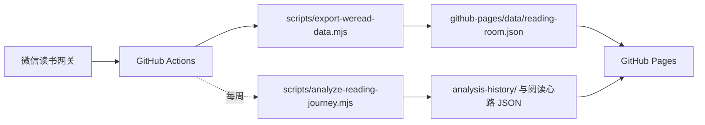

# 枕书｜我的阅读札记

一个由微信读书数据驱动的个人阅读档案，把书架、批注和长期阅读心路整理成一条可以回看的时间线。

在线访问：[cn-hejian.github.io/zhenshu-reading-room](https://cn-hejian.github.io/zhenshu-reading-room/)

## 能做什么

- 展示完整书架、封面、作者、分类和阅读进度
- 按时间浏览划线、想法和点评
- 用搜索和批注日历定位内容
- 展示阅读时长、阅读日和阅读足迹
- 使用 DeepSeek 按周生成长期阅读心路，分析阶段变化、思想转向、长期主题和最爱类别的演化
- 由 GitHub Actions 每天自动同步，页面只发布已经生成的静态数据

## 数据流



同步和分析都在 GitHub Actions 中执行。浏览器只读取公开的静态 JSON，不接触任何密钥。

## 使用自己的数据

### 1. 创建仓库并启用 Pages

将仓库推送到 GitHub，在 **Settings → Pages** 中把发布来源设为 **GitHub Actions**。

### 2. 配置 Secrets

在 **Settings → Secrets and variables → Actions** 中添加：

| Secret | 用途 | 必需 |
| --- | --- | --- |
| `WEREAD_API_KEY` | 调用微信读书网关并导出阅读数据 | 是 |
| `DEEPSEEK_API_KEY` | 生成每周阅读心路 | 否 |

### 3. 运行工作流

打开 **Actions → WeRead GitHub Pages sync**，首次选择 **Run workflow**。之后：

- 每天北京时间 23:30 同步书架、批注和阅读统计
- 每周一北京时间 00:15 生成一次长期阅读心路
- 也可以在 Actions 页面手动运行工作流

如果没有配置 `DEEPSEEK_API_KEY`，网站仍会正常同步和展示阅读数据，只跳过阅读心路生成。

阅读心路采用固定上下文预算：分析输入会分层保留早期锚点、近期变化和月份/类别代表性笔记，并压缩历史归档和长期记忆。发送前会估算输入 Token，超出预算时自动减少历史细节和辅助证据，避免随着归档增长持续扩大请求。

## 本地开发

要求 Node.js 22.13 或更高版本。

```bash
npm install
npm test
```

预览 GitHub Pages 静态站：

```bash
python3 -m http.server 4173 --directory github-pages
```

然后打开 <http://127.0.0.1:4173/>。

需要手动导出数据时，在当前 shell 中提供密钥：

```bash
WEREAD_API_KEY=你的密钥 npm run pages:export
```

需要本地生成阅读心路时：

```bash
DEEPSEEK_API_KEY=你的密钥 npm run journey:analyze
```

## 目录

```text
github-pages/                 静态站页面、样式、脚本和发布数据
lib/weread/core.mjs           微信读书网关请求与数据基础函数
scripts/export-weread-data.mjs 书架、批注和阅读统计导出
scripts/analyze-reading-journey.mjs 阅读心路分析与历史记忆
analysis-history/             阅读心路的长期记忆和历史输入
tests/                        导出、页面、视图模型和分析测试
.github/workflows/            定时同步与 Pages 发布
```

## 数据与安全

- API Key 只保存为 GitHub Actions Secret，不写入源码和前端。
- 同步脚本采用临时文件和原子替换；请求失败或微信读书要求升级时，不覆盖上一份有效数据。
- `github-pages/data/` 会随 Pages 公开发布，其中可能包含个人书架、批注和阅读记录。若这些内容不应公开，请不要使用公开仓库或公开 Pages。
- 本项目不会向微信读书写回内容，也不提供网页端手动同步入口。

## 贡献

欢迎提交 Issue 或 Pull Request。提交前请运行：

```bash
npm test
```

当前仓库未声明开源许可证；如需在仓库外复用代码，请先联系作者确认授权范围。
